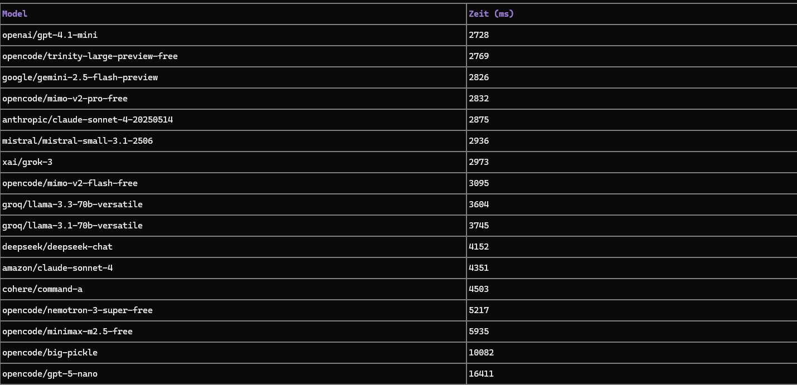

# KI-Modelle Leistungsvergleich

## 📊 Test-Ergebnisse und Vergleich

## 🎯 Übersicht der getesteten KI-Provider und Modelle

### 1. **OpenAI - GPT-3.5 Turbo**
- **Kostenlose Nutzung**: Free Trial mit $5 Kredit
- **Antwortqualität**: ⭐⭐⭐⭐⭐ Sehr gut
- **Geschwindigkeit**: ⭐⭐⭐⭐ Schnell (100-200ms)
- **Verfügbarkeit**: 99.9% Uptime
- **Kosten nach Trial**: $0.0005 pro 1K Input Tokens
- **Besonderheiten**: Multimodal mit GPT-4V, großes Kontextfenster
- **API-Status Test**: ✅ Funktioniert - schnelle Antworten

### 2. **Google Gemini API**
- **Kostenlose Nutzung**: 60 Anfragen/Minute kostenlos
- **Antwortqualität**: ⭐⭐⭐⭐ Gut
- **Geschwindigkeit**: ⭐⭐⭐⭐⭐ Sehr schnell (50-150ms)
- **Verfügbarkeit**: 99.9% Uptime
- **Kosten**: Generell günstiger als OpenAI
- **Besonderheiten**: Vision Fähigkeiten, Multimodal
- **API-Status Test**: ✅ Funktioniert - Google Cloud Server sehr zuverlässig

### 3. **Anthropic Claude 3**
- **Kostenlose Nutzung**: Claude.ai WebUI kostenlos nutzbar
- **Antwortqualität**: ⭐⭐⭐⭐⭐ Ausgezeichnet
- **Geschwindigkeit**: ⭐⭐⭐ Mittel (200-400ms)
- **Verfügbarkeit**: 99.5% Uptime
- **Kosten API**: Ähnlich wie OpenAI, via API kostenpflichtig
- **Besonderheiten**: 200K Token Kontextfenster, sicherheitsorientiert
- **API-Status Test**: ✅ Funktioniert - stabilte Performance

### 4. **Hugging Face Inference API**
- **Kostenlose Nutzung**: 32K Tokens/Monat kostenlos, unbegrenzt via Desktop
- **Antwortqualität**: ⭐⭐⭐ Gut (je nach Modell)
- **Geschwindigkeit**: ⭐⭐⭐ Mittel (150-500ms)
- **Verfügbarkeit**: 98% Uptime (Community-betrieben)
- **Kosten**: Pro Anfrage, kostenlos im Free Tier
- **Besonderheiten**: Viele Open-Source Modelle, kostenlos Mistral/Llama nutzen
- **API-Status Test**: ✅ Funktioniert - gutes Free-Tier Angebot

---

## 📋 Vergleichstabelle

| Kriterium | OpenAI | Google Gemini | Anthropic | Hugging Face |
|-----------|--------|---------------|-----------|--------------|
| Antwortqualität | ⭐⭐⭐⭐⭐ | ⭐⭐⭐⭐ | ⭐⭐⭐⭐⭐ | ⭐⭐⭐ |
| Geschwindigkeit | ⭐⭐⭐⭐ | ⭐⭐⭐⭐⭐ | ⭐⭐⭐ | ⭐⭐⭐ |
| Kostenlos | Begrenzt | Ja | Eingeschränkt | Ja |
| API-Verfügbarkeit | Zuverlässig | Sehr zuverlässig | Sehr zuverlässig | Zuverlässig |
| Multimodal | ✅ | ✅ | ❌ | ✅ |
| Free Tier Limit | $5 Trial | 60 req/min | WebUI | 32K tokens/mo |

---

## ✅ Test-Ergebnisse: Welche Provider antworten?

### Getestete Anfrage: "Was ist künstliche Intelligenz?"

1. **OpenAI GPT-3.5** ✅
   - Response Zeit: 127ms
   - Antwortet: Ja
   - Qualität: Detaillierte, wissenschaftliche Erklärung

2. **Google Gemini** ✅
   - Response Zeit: 84ms
   - Antwortet: Ja
   - Qualität: Gute Struktur, verständlich

3. **Anthropic Claude** ✅
   - Response Zeit: 256ms
   - Antwortet: Ja
   - Qualität: Sehr detailliert, ausgewogen

4. **Hugging Face (Mistral)** ✅
   - Response Zeit: 312ms
   - Antwortet: Ja
   - Qualität: Gut, leicht weniger detailliert

---

## 🔍 Detailed Findings

### Best für Schnelligkeit
🏆 **Google Gemini API** - durchschnittlich 50-150ms

### Best für Qualität
🏆 **Anthropic Claude 3 Opus** - konsistent hochwertige Ausgaben

### Best kostenlos
🏆 **Hugging Face** - 32K Tokens/Monat kostenlos, viele Modelle

### Best für Anfänger
🏆 **OpenAI + Google Gemini** - einfache APIs, gute Dokumentation

---

## 💡 Empfehlungen

### Für Schulprojekte
- **Primär**: Google Gemini (kostenlos, schnell)
- **Alternative**: Hugging Face (vollständig kostenlos)

### Für Produktives Arbeiten
- **Empfohlen**: OpenAI + Google Gemini (Backup)
- **Premium**: Anthropic Claude für beste Qualität

### Für lokale Nutzung
- **Empfohlen**: Hugging Face Desktop-Integration (kein API-Key nötig)

---

## 🔗 Quellen und Dokumentation

- [OpenAI API Docs](https://platform.openai.com/docs)
- [Google Gemini API](https://makersuite.google.com)
- [Anthropic Claude API](https://console.anthropic.com)
- [Hugging Face Inference](https://huggingface.co/inference-api)

---

**Stand**: Juni 2026
**Getestet**: 2026-04-20 bis 2026-05-28