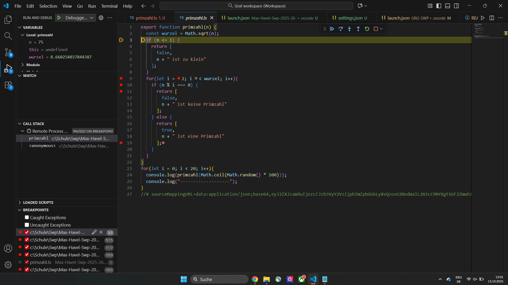
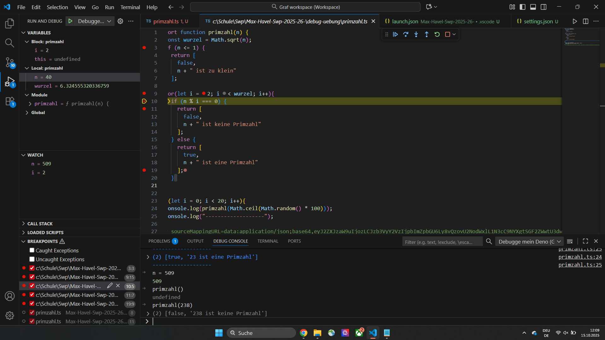
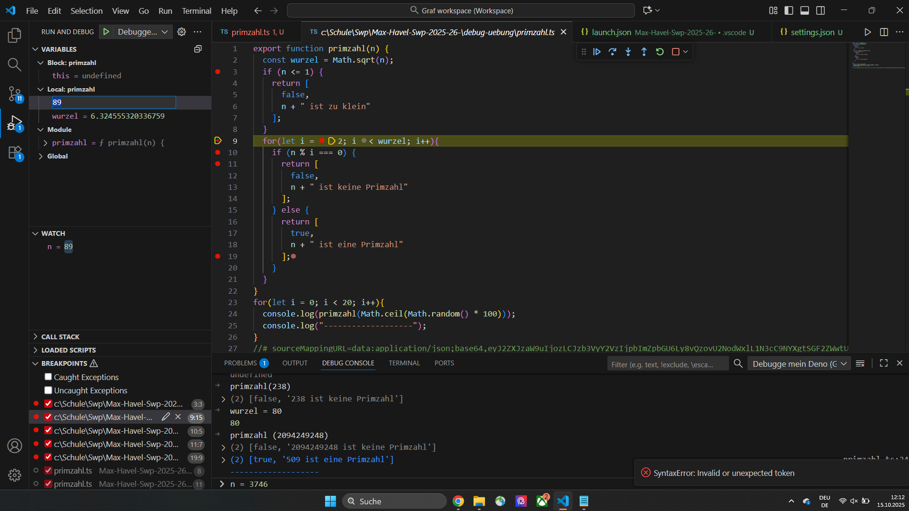

# Max-Havel-Swp-2025-26-   

notiz für mich ceil --> rundet immer auf
                floor --> schreibt die komma zahl einfach ohnen kommas
Bsp.
let a;
--> a = (Math.random() * 100)
Math.floor (a)

wenn ich es richtig verstanden habe ist die chace sehr gering, dass beim Testen das richitge rauskommt weil man die verschiedenen Brüche mit anderen Zahlen erweitert.

ich lasse zwei Lösungsansätzte stehen 

------------------------------------------------------
HÜ 
deno tests liste mit 10 primzahlen und 10 keine und dann mit true und false returnen 

funktionierender Debugger:

function selbst im debugger aufgerufen:

Variablen Werte geändert:

--> Bilder im Bilder Folder Link funtioniert nicht mehr

Hinweis: in den screenshot ist noch ein alter debugger
habe jetzt einen anderen aber beide funktionieren 

HÜ zum machen 
cheatshet durchlesen